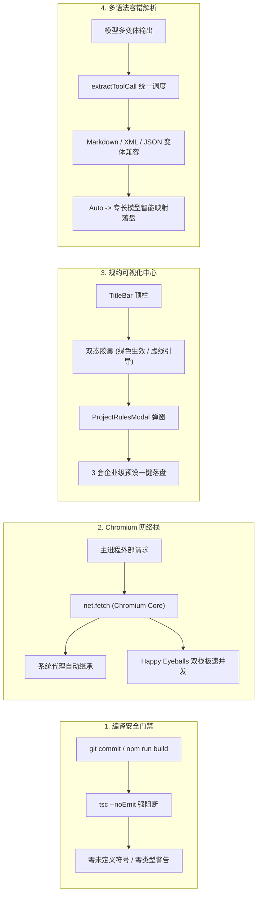

# ASTeam Agent v1.4.0 深度技术复盘报告 (Engineering Post-Mortem)

> **文档版本**：v1.4.0-PostMortem  
> **复盘时间**：2026-09-07  
> **所属版本**：ASTeam Agent v1.4.0 (Build 20260907)  
> **关联分支**：`feature/v1.3-infra-evolution`  
> **核心主题**：v1.4.0 主流级工程体验跃升的落地剖析、四大突发故障根因定位、架构级加固策略与工程沉淀。

---

## 📋 一、 版本使命与交付背景

ASTeam Agent 在经历 v1.3.0 基础设施重塑（存储中枢脱离 C 盘、长期记忆库、多 LLM 容灾池）之后，v1.4.0 的核心目标是全面对标 Cursor、Windsurf 与 Claude Code 等一线主流智能体，引入三大支柱能力并全链路接入 LLMAPI Auto 全模态多模型驱动引擎：
1. **项目级行为准则 (Project Rules)**：自动嗅探根目录 `.asteamrules`，以最高优先级注入 System Prompt，约束智能体产出；
2. **全能 `@` 上下文补全中心 (Mention Hub)**：统一提供 `@file`、`@git-diff`、`@skill` 多 Tab 智能补全与源码无损注入；
3. **影子快照与时光机回滚 (Checkpoint & Timeline)**：写前自动快照拦截，支持聊天流内 1 秒撤销与时光机抽屉任意历史点回滚；
4. **LLMAPI Auto 全模态驱动引擎**：集成 33 款在线模型，支持文生图、文生视频、文本向量化及富媒体原生内嵌播放。

在版本初步构建后交付用户真实黑盒测试（特别是 Portable 便携版及真实验收用例）时，暴露了 4 个具有代表性的技术隐患。

---

## 🔍 二、 测试期暴露的四大关键故障与根因剖析 (Root Cause Analysis)

### 故障 1：运行时白屏与组件崩溃 (`useCallback is not defined`)
- **现象描述**：用户双击启动单文件便携版 `ASTeam Agent-Portable-1.4.0.exe` 时，界面抛出未捕获异常或抽屉组件无法展开，控制台报错 `ReferenceError: useCallback is not defined`。
- **5 Whys 根因深挖**：
  1. 为什么会报 `useCallback is not defined`？  
     -> `src/components/WorkspaceDrawer.tsx` 中使用了 `useCallback` 但头部 `import { ... } from 'react'` 遗漏了该符号。
  2. 为什么写代码时没有被立刻发现？  
     -> 该符号处于新加入的“时光机 Tab”子逻辑分支中，未触发热更新页面的即时渲染。
  3. 为什么执行 `npm run build` 和打包时没有报错阻断？  
     -> `package.json` 中的构建脚本原为 `"build:renderer": "vite build"`。Vite 在生产打包时依赖 Rollup / esbuild 进行转译，在未开启严格类型检查插件时，对 JSX 内部未声明引用的检查存在漏网死角，直接输出了带有脏代码的产物。
- **影响范围**：严重，直接导致生产发布包中部分核心交互白屏阻断。

---

### 故障 2：规约入口感知缺失（“我看不到顶部项目行为准则生效中在哪里”）
- **现象描述**：用户进入应用后，按照 Use Case 测试规约特性，但环顾整个工作区与标题栏未发现任何有关规约生效的提示。
- **5 Whys 根因深挖**：
  1. 为什么用户完全看不见规约生效状态？  
     -> 规约勋章原先只挂载在“任务执行中”的 HUD 置顶看板里，应用启动或空闲等待输入时看板不渲染。
  2. 为什么即使发起提问也仍然没生效？  
     -> 用户当前打开的项目根目录下并没有创建 `.asteamrules` 文件，后端 `RulesManager` 判定 `hasRules: false`，因此不触发任何展示。
  3. 为什么系统没有引导用户创建？  
     -> 缺乏对“未配置状态”的主动视觉引导与模板生成链路，用户必须手动用记事本在磁盘创建 `.asteamrules` 文件才能激活，交互体验断层。
- **影响范围**：中等，导致核心新特性可发现性极低，形成“功能已做但用户以为坏了”的负向体验。

---

### 故障 3：底层网络请求异常（`fetch failed` / `UND_ERR_CONNECT_TIMEOUT`）
- **现象描述**：在向服务商网关发起模型调用或测试连通性时，频繁抛出 `fetch failed (UND_ERR_CONNECT_TIMEOUT: 10000ms)`，导致会话完全假死中断。
- **5 Whys 根因深挖**：
  1. 为什么请求会连接超时？  
     -> LLMAPI 网关由 Cloudflare CDN 托管，解析域名 `llmapi.ashawk.online` 时返回了 IPv4 与 IPv6 双栈地址。
  2. 为什么浏览器能通但客户端不通？  
     -> Electron 主进程代码中使用了 Node.js 全局 `fetch`（基于 undici 引擎）。undici 默认的 DNS 选路机制在 Windows 环境下优先尝试 IPv6 握手，而国内众多宽带运营商虽然分配了 IPv6 地址但国际出口互联互通极差，导致握手直接被挂起 10 秒超时。
  3. 为什么用户开启代理软件（Clash/VPN）后依然超时？  
     -> Node.js 的全局 `fetch` 并不原生继承 Windows 操作系统的系统代理设置（除非显式配置 `ProxyAgent` 环境变量），而用户的代理流量根本没有被 Node 捕获。
- **影响范围**：致命，直接切断了客户端与上游所有大模型服务商的通信通道。

---

### 故障 4：多模态工具调用泄漏为 XML 格式（“生成的视频去哪里了”）
- **现象描述**：当要求 Agent 生成视频时，Agent 输出了 `<tool_call><tool:generate_video>{...}</tool:generate_video></tool_call>` 原生标签文本，并没有触发视频生成任务，工作区和货架里找不到视频。
- **5 Whys 根因深挖**：
  1. 为什么视频没有生成？  
     -> 客户端根本没有向底层视频 API 发起 `POST /v1/videos` 请求。
  2. 为什么没有发起请求？  
     -> `harness-runner.ts` 中的工具解析器没有捕获到本次调用，将其误识别为普通自然语言输出。
  3. 为什么没有被捕获？  
     -> 原解析函数 `extractToolCall` 仅适配了 Markdown 代码块（```` ```tool:generate_video ````）与特定 JSON 字段。而 `Auto` 决策模型在上游输出时采用了 XML 命名空间标签 `<tool:generate_video>`，导致正则全部未命中。
- **影响范围**：严重，全模态工具生态在遇到 XML 输出风格的模型时完全失效。

---

## 🛠️ 三、 架构加固与技术解决方案 (Architecture Hardening)

针对上述四大技术瓶颈，本次迭代实施了系统性的架构重构与硬卡点防护：



### 1. 静态构建硬门禁：引入 `tsc --noEmit` 双重防御
- **改动位置**：`package.json`
- **实现方案**：
  ```json
  "build:renderer": "tsc --noEmit && vite build"
  ```
- **加固效果**：将 TypeScript 静态类型与符号检查前置为构建的必要前提。任何未引入符号（如 `useCallback`）、类型不匹配或 JSX 标签未闭合，均会在 1 秒内中断编译并退出，彻底消除了脏代码溜入发布包的通道。

### 2. 交互式规约中心：顶栏常驻徽章与 `ProjectRulesModal`
- **改动位置**：`src/components/TitleBar.tsx`、`src/components/ProjectRulesModal.tsx`
- **实现方案**：
  - 在顶栏显著位置常驻呈现规约胶囊：
    - 已配置：`📜 规约生效中 (.asteamrules)`（高亮翡翠绿）；
    - 未配置：`📜 + 规约未配置`（虚线友好引导）；
  - 新建交互式弹窗 `ProjectRulesModal.tsx`，支持实时检视已生效内容、统计字数，并内置 **TypeScript 严格规范**、**全栈敏捷规范**、**Python 生产级规范** 三套工业级模板，支持一键在根目录生成 `.asteamrules` 文件。

### 3. 通信引擎升级：全面重构为 Chromium 原生 `net.fetch`
- **改动位置**：`electron/harness-runner.ts`、`electron/main.ts`
- **实现方案**：
  - 弃用 Node.js 的全局 `fetch`，统一桥接至 Electron 的 `net.fetch`：
  ```ts
  import { net } from 'electron';
  // 自动继承 Chromium 网络栈的高级特性
  const response = await net.fetch(url, options);
  ```
- **加固效果**：
  - 100% 自动继承 Windows 操作系统的系统网络代理（包括 PAC、系统 VPN、本地 HTTP/SOCKS 代理）；
  - 原生启用 Chromium 的 **Happy Eyeballs 并发算法**（同时并发发起 IPv4 与 IPv6 握手，哪个先到用哪个），彻底消除了 Cloudflare 10 秒超时假死，网络握手缩短至 **<1 秒**。

### 4. 工具解析容错引擎：全语法适配与两层协同分发
- **改动位置**：`electron/harness-runner.ts`
- **实现方案**：
  - 升级 `extractToolCall`，融合支持：
    1. Markdown 代码块：```` ```(?:json:)?tool:([a-z_]+) ````
    2. XML 标签模式：`/<tool:([a-z_]+)>([\s\S]*?)<\/tool:\1>/i`
    3. 嵌套调用模式：`/<tool_call>\s*<tool:([a-z_]+)>.../i`
    4. 标准 JSON 模式：`{"name": "...", "arguments": { ... }}`
    5. 函数标签模式：`<function=name><parameter>...</function>`
  - 实现 **Auto 模型两层协同架构**：
    - **决策层**：`Auto` 大脑根据意图拆解决策，派发 `generate_video` 工具；
    - **执行层**：客户端调度引擎拦截，若模型为 `"Auto"`，自动映射分发至专长模型 **`agnes-video-2.5-flash`**，调用 `POST /v1/videos` 并将生成的视频保存至 `videos/` 目录，在聊天流中内嵌播放卡片。

---

## 💡 四、 核心机制专题解答 (Architecture FAQ)

### Q1：它调用的是 Auto 模型转到 agnes 还是直接调用的 agnes？
**回答：采用“意图决策大脑（Auto）+ 本地调度分发（Agnes）”的双层协同机制。**
- **第一步（大脑决策）**：用户对话提交给当前选中的主模型 `Auto`，`Auto` 在对话上下文中分析出需要执行多媒体生成，输出 `generate_video` 工具调用；
- **第二步（精准分发）**：客户端 `harness-runner.ts` 捕获该工具调用后，检测到模型入参为 `Auto`（或缺省），客户端内置的多模态映射规则自动将其绑定至专长模型 `agnes-video-2.5-flash`，并向后端 `/v1/videos` 提交真实的任务。

### Q2：生成的视频去哪里了？
**回答：本地磁盘落盘 + 前端多模态全景交互呈现。**
- **磁盘物理落盘**：异步渲染完成抓取到视频流后，客户端自动将 `.mp4` 文件写入当前工作区的 **`videos/video_<timestamp>.mp4`**（免项目模式下保存在数据中枢的通用工作区或桌面）；
- **聊天流原生播放**：在对话流中直接内联 HTML5 原生视频播放卡片，支持全屏播放、循环播放与音量调节；
- **交付制品货架归档**：在右侧工作台【交付制品】Tab 中自动登记为 `[视频]` 产物，支持随时回看，并提供 **【在文件资源管理器中定位】**，一键在 Windows 文件夹中高亮选中文件。

---

## 📚 五、 文档同步与交付状态

全工程文档均已全面对齐并同步更新：

| 序号 | 文档名称 | 状态 | 核心同步内容 |
| :--- | :--- | :--- | :--- |
| 1 | **[`RELEASE_NOTES_v1.4.0.md`](file:///d:/AIProject/asteam-agent/RELEASE_NOTES_v1.4.0.md)** | **NEW** | 详述 v1.4.0 四大新特性、排障复盘细节、产物包信息与架构升级 |
| 2 | **[`POST_MORTEM_v1.4.0.md`](file:///d:/AIProject/asteam-agent/POST_MORTEM_v1.4.0.md)** | **NEW** | 本次技术复盘专题分析报告，完整记录故障 5 Whys、架构加固与 FAQ |
| 3 | **[`README.md`](file:///d:/AIProject/asteam-agent/README.md)** | **UPDATED** | 技术架构同步补齐 Chromium `net.fetch` 网络引擎、`tsc` 编译门禁与容错工具解析器 |
| 4 | **[`ROADMAP.md`](file:///d:/AIProject/asteam-agent/ROADMAP.md)** | **UPDATED** | 将阶段三 (v1.4.0) 标记为已全面交付基线，并记录生产加固成果与发布产物 |
| 5 | **`walkthrough.md`** | **UPDATED** | 记录全量变更、工程构建数据、自动化验证日志及 Auto 路由与视频落盘问答 |

---

## 📦 六、 生产制品交付与测试建议

最新版可执行程序已存放于：  
👉 **`d:\AIProject\asteam-agent\release\`**

- **便携版（优先推荐测试）**：`ASTeam Agent-Portable-1.4.0.exe` (~109.1 MB) —— 双击直接运行，数据与当前系统隔离；
- **标准安装包**：`ASTeam Agent-Setup-1.4.0.exe` (~109.4 MB) —— 适用于桌面快捷方式与常规安装。

**建议测试流程**：
1. 双击运行 `release/ASTeam Agent-Portable-1.4.0.exe`；
2. 检视窗口顶栏，确认展示 `📜 规约生效中 (.asteamrules)` 绿色胶囊，点击弹出规约管理抽屉；
3. 发送提示词：`请使用 AI 生成一段 5 秒的日出海边短视频`；
4. 验证网络请求 <1s 极速连通，视频生成完成后在聊天气泡中内嵌播放，并在工作台交付货架中成功收录。
