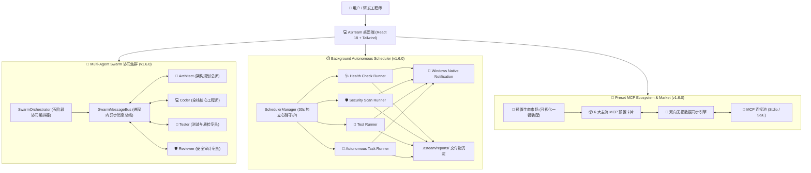

# ASTeam Agent v1.6.0 官方发布说明 (Release Notes)

> **发布版本**：v1.6.0 (Build 20260909)  
> **代码基线**：分支 `feature/v1.6-multi-agent-swarm`  
> **核心定位**：【阶段五：v1.6.0 深度自治与多智能体协同 (Multi-Agent Swarm & Autonomous Scheduler)】圆满收官。全面突破单智能体串行交互局限，打造由四大专业角色构成的蜂群协同拓扑与进程内异步消息总线，落地脱离前台 UI 的高精度后台自主长程巡检与调度引擎，并上线内置 MCP 预置生态市场与可视化一键装配面板。

---

## 🌟 版本核心特性全景 (Core Highlights)

### 一、🤖 多智能体分工协同架构 (Multi-Agent Swarm / Team Collaboration)
- **四大专业角色拓扑体系 (`SwarmAgentRole`)**：
  - **🎯 Architect / Planner（架构主控总师）**：负责意图拆解、工作区规约检视、任务依赖图（DAG）构建与全局交付物聚合；
  - **💻 Coder / Engineer（全栈研发工程师）**：专注于高质量代码改写与重构，受影子快照（Shadow Checkpoint）原生级时光机保护；
  - **🧪 Tester / QA Specialist（测试与质量保障）**：自动执行单元测试 (`npm test`) 与静态类型校验 (`tsc --noEmit`)，生成缺陷日志；
  - **🛡️ Reviewer / Security Auditor（规约与安全审计）**：核对 `.asteamrules` 项目规约、类型安全与设计坏味道，签发合规评分卡。
- **进程内跨 Agent 异步消息总线 (`SwarmMessageBus`)**：
  - 基于轻量事件模型，维护全局 `SwarmState`（集群阶段、活跃角色、任务 DAG、消息交互流）；
  - 角色间支持定向广播与点对点派发，通过 IPC 向渲染进程实时推送拓扑事件。
- **五阶段协同调度闭环流水线 (`SwarmOrchestrator`)**：
  - 编排 `Planning` ➔ `Executing` ➔ `Verifying` ➔ `Reviewing` ➔ `Delivery` 严密闭环。
- **前端沉浸式协同拓扑看板 (`SwarmDashboard`)**：
  - 对话流内嵌全景看板：阶段徽章、4 角色动态卡片矩阵、任务拓扑泳道（DAG）与消息交互流抽屉；
  - 底部输入区支持【🤖 蜂群协同 (Swarm)】模式切换与 `/swarm` 快捷指令。

---

### 二、⏱️ 后台长程自主巡航任务与定时调度器 (Background Scheduler & Autonomous Runner)
- **主进程独立常驻调度引擎 (`SchedulerManager`)**：
  - 脱离前台 UI 窗口限制，基于 30 秒高精度心跳守护；
  - 数据统一持久化至存储中枢 `scheduler_tasks.json`；
  - 支持 `every_30m`、`every_1h`、`every_2h`、`every_6h`、`daily_2am`、`daily_9am`、`weekly` 多种调度周期；
  - 任务巡检完成自动触发 Windows 原生系统气泡通知 (`Notification`)。
- **四维专业化自主巡检执行器**：
  - 🩺 **工作区健康体检 (`health_check`)**：自动执行类型校验、`.asteamrules` 规范遵循度评估与 Git 滞留状态分析，输出 0~100 综合评分卡；
  - 🛡️ **依赖安全与敏感泄露扫描 (`security_scan`)**：深度调用 `npm audit` 审查 CVE 漏洞，全库扫描明文 API Key 与证书泄露风险；
  - 🧪 **自动化单测巡检 (`test_runner`)**：自动探测并执行项目单测，捕获用例覆盖与报错日志；
  - 🤖 **长程自主编码巡航 (`autonomous_task`)**：支持用户自定义 Prompt 目标，在无人值守状态下后台静默执行长流程重构或脚本生成。
- **交付制品库自动沉淀**：
  - 每次巡检完毕，自动在工作区 `.asteam/reports/` 目录下生成标准化 Markdown 报告（如 `health_report_2026-09-09_18-00.md`），并无缝入库货架。
- **工作台看板集成 (`SchedulerTab`)**：
  - 右侧抽屉第 6 标签页【⏱️ 自主巡检】，集成任务卡片矩阵、即时触发按钮、状态指示灯与 Markdown 报告内联渲染；
  - 支持对话输入框触发 `/schedule` 快捷唤出。

---

### 三、📦 内置 MCP 预置生态市场与可视化一键装配 (Preset MCP Ecosystem & Visual Assembly)
- **精选 6 款官方与主流生产级 MCP 插件预置**：
  1. 📁 **本地文件系统 (Filesystem)**：`@modelcontextprotocol/server-filesystem`（沙箱化白名单目录限制）；
  2. 🗄️ **SQLite 嵌入式数据库**：`mcp-server-sqlite`（通过 `uvx` 运行 Python 原生 SQLite MCP 服务）；
  3. 🐘 **PostgreSQL 数据库引擎**：`@modelcontextprotocol/server-postgres`（支持表结构透视与 SQL 检索执行）；
  4. 🐙 **GitHub 官方平台集成**：`@modelcontextprotocol/server-github`（PAT 访问令牌注入，支持全库代码检索与 PR/Issue 联动）；
  5. 🌐 **Puppeteer 浏览器自动化**：`@modelcontextprotocol/server-puppeteer`（无头 Chrome 驱动网页自动化交互与渲染抓取）；
  6. ⚡ **Git 本地版本库专攻**：`mcp-server-git`（基于 `uvx` 深度 Blame、Diff 与版本历史追踪）。
- **双向无损实时同步引擎 (`mcpPresets.ts`)**：
  - 纯函数转换引擎，在可视化卡片配置与标准 `customMcpConfig` (JSON) 之间实现双向无损实时同步。
- **可视化卡片与双模式切换 (`McpPresetCard.tsx` / `SettingsModal.tsx`)**：
  - 【预置生态市场】与【原始 JSON 高级配置】无缝切换；
  - 提供分类筛选药丸、关键词检索、参数展开折叠编辑（密码带显隐切换）、单服务一键即时探活测试与运行时健康状态指示灯。

---

## 🛠️ 关键技术架构演进 (Technical Architecture)

---

## 📦 官方安装包与绿色便携版产物清单 (Artifacts)

全量编译与打包均已严格通过（`npm run build` + `electron-builder --win --x64`），安装包位于工作区 `dist-release/` 目录：

| 文件名称 | 文件类型 | 文件大小 | 适用场景 |
| :--- | :--- | :--- | :--- |
| **`ASTeam Agent-Setup-1.6.0.exe`** | Windows NSIS 安装包 | 117.29 MB | 推荐企业研发日常使用，支持自定义目录、快捷方式与完全卸载 |
| **`ASTeam Agent-Portable-1.6.0.exe`** | Windows 绿色便携版 | 116.96 MB | 即开即用，无需安装管理员权限，适合 U 盘携带或离线沙箱环境 |
| **`ASTeam Agent-Setup-1.6.0.exe.blockmap`** | 增量更新元数据文件 | 123.59 KB | 客户端增量热升级校验 |

---

## 🎯 总结与复盘 (Retrospective Summary)

### 1. 攻坚亮点
1. **拓扑协同真正落地**：将原有的大模型单一单轮“对话回复”升级为具备角色自省、测试打磨与安全把关的“团队交付”工作流；
2. **长程守护释放前台**：后台自主巡航定时器彻底解决了桌面 Agent 必须“常开窗口、手动盯梢”的痛点，定时为仓库输出全方位体检报告；
3. **生态体验门槛大幅降低**：内置 6 大高频 MCP 预置卡片，通过表单填写即可自动组装并进行单服务探活，将专业级 MCP 的接入时间从几十分钟缩短至 10 秒。

### 2. 演进展望 (v1.7.0)
- **企业私有包签名与中心化分发**：支持企业内网搭建私有 MCP 与 Skill 分发源；
- **群组动态增殖 (Dynamic Sub-Agent Spawning)**：支持主控 Agent 根据任务复杂度自适应动态裂变任意数量的临时 Worker 并行提速。
