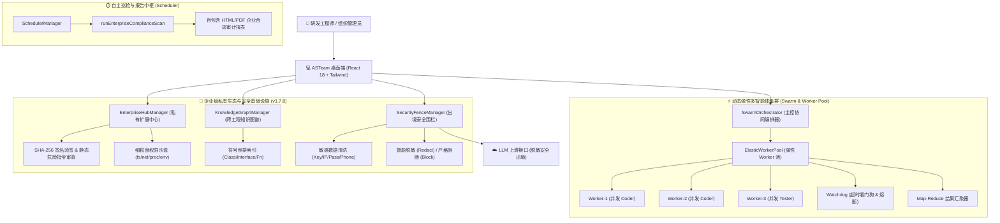

# ASTeam Agent v1.7.0 官方发布说明 (Release Notes)

> **发布版本**：v1.7.0 (Build 20260910)  
> **代码基线**：分支 `feature/v1.7-enterprise-swarm`  
> **核心定位**：【阶段六：v1.7.0 企业级私有生态与动态弹性集群 (Enterprise Ecosystem & Elastic Multi-Agent Swarm)】全面圆满交付。针对大型企业私有化部署、团队技能资产分发、高并发并行研发与出境数据安全诉求，构建集“企业私有 Hub 验签与沙盒”、“自适应动态弹性 Worker 增殖池”、“跨工程符号知识图谱”与“出境流量智能脱敏与安全围栏”于一体的企业级智能体底座。

---

## 🌟 版本核心特性全景 (Core Highlights)

### 一、🏢 企业级私有 MCP & Skill 扩展中心 (Enterprise Private Hub & Security Sandbox)
- **三大私有分发接入渠道**：
  - 🌐 **私有 Git 仓库导入**：支持企业内网 GitLab / GitHub Enterprise / Gitea 仓库 URL 及指定分支/Tag 一键拉取；
  - 📦 **私有 npm Registry 导入**：支持企业内部 Verdaccio / Nexus 等私有 npm 包一键安装与元数据解析；
  - 📁 **离线 ZIP 扩展归档包导入**：针对完全物理隔离的内网专网环境，支持直接选定 `.zip` 归档包解压加载。
- **强约束安全验签与静态危险审查引擎 (`EnterpriseHubManager`)**：
  - 🔐 **SHA-256 哈希完整性验签**：对所有导入产物与分发源生成或校验强散列防伪签名，防范供应链投毒；
  - ⚠️ **静态沙盒语法与模式审查**：在扩展装配前自动扫描清单与代码，实时侦测并阻断 `format`、`rm -rf /`、`wipe`、`mkfs` 等高危系统级破坏指令；
  - 🛡️ **安全等级评级机制**：依据扫描结果与签名状态自动标识 `trusted` (企业受信)、`community` (社区级) 与 `danger` (高危拦截)。
- **细粒度权限沙盒徽章与运行时隔离**：
  - 权限矩阵可视化：清晰展示扩展声明的文件系统读写 (`fs_read`/`fs_write`)、网络访问 (`network`)、子进程拉起 (`process`) 及环境变量读取 (`env`) 权限徽章；
  - 离线持久化缓存与热插拔：所有企业扩展沉淀于存储中枢 `enterprise_hub/` 专属目录，支持一键启停，无缝合并至技能与 MCP 运行时中枢。
- **现代化可视化管理控制台 (`EnterpriseHubModal`)**：
  - 顶栏快捷入口一键呼出，具备卡片式扩展列表、状态指示灯、安全等级评级、权限列表、私有导入抽屉向导与一键卸载功能。

---

### 二、⚡ 动态自适应弹性子智能体集群与 Worker 池 (Dynamic Sub-Agent Spawning & Elastic Worker Pool)
- **突破固定角色拓扑，自适应动态 Worker 增殖**：
  - 告别固化 4 角色串行限制。主控智能体（Orchestrator）在进入 `Executing`（编码）与 `Verifying`（测试）关键阶段时，依据 DAG 子任务复杂度，自适应裂变孵化多名临时轻量工作代理 (`SwarmWorkerAgent`)；
  - 动态分配 Worker ID（如 `worker-coder-0`、`worker-tester-1`）与专注子任务上下文。
- **高韧性弹性并发池与熔断看门狗 (`ElasticWorkerPool`)**：
  - 🚦 **并发配额上限管控**：默认并发度上限为 4（支持 1~16 自适应调节），保障本地 CPU/内存及模型 API 频控稳健；
  - ⏱️ **执行超时看门狗 (Watchdog)**：单 Worker 默认设定 120 秒超时阈值，防止子代理深陷死循环假死；
  - 🔄 **自动重试机制**：子任务执行异常支持最多 2 次指数退避重试，提升复杂重构成功率。
- **Map-Reduce 结果汇聚聚合器 (`reduceResults`)**：
  - 并行执行完毕后，聚合器自动汇总各 Worker 生成的代码 Diff、单元测试日志与耗时开销，统一交由审查员（Reviewer）进行团队规约核验。
- **沉浸式 Worker 弹性泳道看板 (`SwarmDashboard`)**：
  - 拓扑看板新增专属【⚡ 动态弹性子智能体池 (Elastic Worker Pool)】卡片式泳道；
  - 实时展示活跃 Worker 数、并发水位指示器、各 Worker 百分比进度条、累计消耗 Token 水位与执行耗时指标，支持详细状态折叠展开。

---

### 三、🛡️ 跨工程知识图谱与出境安全围栏 (Knowledge Graph & Outbound Security Fence)
- **跨工作区符号级联合知识图谱 (`KnowledgeGraphManager`)**：
  - 跨多仓库工程联合扫描索引，极速提取 TypeScript/JavaScript 源代码中的 `class`、`interface`、`function`、`type` 与 `enum` 等符号定义；
  - 建立内存级倒排索引，毫秒级快速检索跨工程符号依赖；
  - 生成针对 LLM 的上下文优化 Prompt，大幅降低大模型在多仓库协作开发中的幻觉。
- **出境流量敏感数据拦截与脱敏引擎 (`SecurityFenceManager`)**：
  - 🔒 **全流量出口前置网关**：在 `HarnessRunner` 发送大模型 API 请求前执行强审查；
  - 🛡️ **六大敏感特征自动识别**：精准正则与语义特征提取，覆盖 LLM API Key (sk-*)、企业内网私有 IP (10.*, 172.16-31.*, 192.168.*)、数据库明文密码、手机号、身份证号及内网敏感域名；
  - 🎭 **智能脱敏模式 (Redact)**：将敏感资产替换为语义化占位符（如 `<API_KEY_REDACTED_1>`、`<PRIVATE_IP_REDACTED_2>`），保持上下文语意完整的同时杜绝数据泄漏；
  - 🚫 **严格阻断模式 (Block)**：一旦探测到高危资产泄漏风险，立即中断模型请求并向用户和总线发出安全预警；
  - ⚪ **安全白名单机制**：支持将内部测试域名、`localhost`、`127.0.0.1` 列入白名单例外。
- **企业级安全合规巡检与结构化 HTML/PDF 审计报表**：
  - 后台常驻调度器 (`SchedulerManager`) 预置加入 `enterprise_compliance` 任务类型；
  - 深度扫描工作区敏感资产暴露、代码健康度、项目规约遵从度及出境围栏防御状态；
  - 自动在 `.asteam/reports/` 目录下生成自包含（Zero-Dependency）、支持一键打印/转存 PDF 的现代化企业合规审计 HTML 报表。
- **安全合规管理控制台 (`SecurityComplianceModal`)**：
  - 支持防护模式切换、脱敏沙盒即时测试验证、跨工程知识图谱符号检索与出境脱敏审计日志实时透视。

---

## 🛠️ 关键技术架构演进 (Technical Architecture)

---

## 📊 质量验证与工程指标 (Quality & Benchmarks)

- **自动化验证套件**：`npm run test:verify` 执行 5 大测试组、**53 项自动化断言全部通过 (53/53 PASS, 0 FAIL)**；
- **强类型与代码构建**：
  - `tsc --noEmit`：0 错误、0 警告；
  - `vite build`：生产环境打包耗时 ~18s，单文件规范拆分良好；
  - `esbuild`：主进程自动化管道成功编译产出 `dist-electron/main.cjs` 与 `preload.cjs`；
- **向后兼容性**：100% 兼容 v1.6.0 的数据存储结构、时光机快照、MCP 预置市场与调度器任务。
