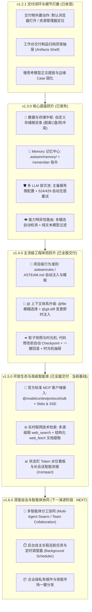

# ASTeam Agent 产品演进全景路线图 (Roadmap)

> **版本定位**：企业级 Windows 桌面智能体客户端 · 基于 `deepseek-harness` 内核深度封装，集成实时交互控制台、原生多模态产物所见即所得预览、全周期置顶看板、自主演进技能体系与全能宿主操作能力。
> **规划周期**：2026 Q1 - Q3 · 从“单机体验完善”到“企业级工程智能体”的完整演进。

---

## 🎯 核心演进理念

1. **工程化与确定性 (Determinism & Safety)**：智能体不仅要“能写代码”，更要“可控、可撤销、可回滚”，杜绝破坏用户生产代码库；
2. **零环境污染与可移植 (Storage & Isolation)**：数据与工作区彻底脱离 C 盘，用户自由指定存储根目录，绝不与 Cursor、Claude Code、Cline 等其他 Agent 争夺路径或锁定文件；
3. **长期记忆与沉淀 (Memory & Knowledge)**：告别“每次开新会话都要重新教一遍”，打造越用越聪明的专属智能工程助理；
4. **高可用容灾网络 (Multi-Provider Resilience)**：建立多服务商容灾池，底层自动消化 Cloudflare 524 超时与 429 限流，让交互永不断线；
5. **开放标准生态 (Open Standards)**：从自建 Markdown 技能平滑升级至 Anthropic 官方推行的标准 MCP (Model Context Protocol) 客户端。

---

## 🗺️ 全景阶段总览

---

## 📍 阶段一：v1.2.1 交付闭环与细节打磨（已收官）

### 目标与定位
彻底巩固 v1.2.0 已落地的各项交互与多模态特性，打通交付制品从“应用内预览”到“Windows 桌面外置应用”的最后一公里，并提供统一的制品货架抽屉。

### 核心特性交付清单
1. **🌐 交付制品外置动作 (External Delivery Actions)**：
   - **在系统默认浏览器中打开**：HTML 大屏、可视化报表支持调用系统默认浏览器（Chrome / Edge / Firefox）以独立标签页全屏渲染与交互；
   - **在文件资源管理器中定位 (Reveal in Explorer)**：生成的 `.html`、`.svg`、`.docx`、`.pptx` 文件支持一键高亮选中并唤起 Windows 资源管理器目录；
2. **📦 工作台交付制品归档货架抽屉 (Artifacts Shelf)**：
   - 右侧工作台增加【交付制品】独立标签页；
   - 自动汇总当前会话生成的所有大屏、图表、流程图与 Office 文档；
   - 支持按类型过滤、点击卡片直接载入预览、一键导出或外置打开；
3. **🛡️ 慢思考模型提拔与边缘 Case 固化**：
   - 针对部分 OpenAI 兼容中转网关将所有输出塞入 `reasoning_content` 的情况，确保消息正文、产物预览卡片 100% 正常提拔呈现；
   - 完善空消息气泡的过滤与兜底文案。

---

## 📍 阶段二：v1.3.0 核心底座跃升（存储隔离 + 记忆 + 多LLM容灾）

### 目标与定位
重构客户端基础设施底座，解决企业开发中最痛的“C盘空间报警”、“多 Agent 路径冲突”、“会话记忆丢失”与“上游网关 524 频繁假死”四大顽疾。

### 核心特性交付清单
1. **📁 数据与存储中枢 (Storage & Data Hub)**：
   - **脱离 C 盘，自由指定存储根目录**：在设置中心支持将 ASTeam 存储根目录配置在任意大容量磁盘（如 `D:\ASTeamData\` 或 `E:\AIWorkspace\`）；
   - **子目录模块化隔离**：
     - `workspaces/`：免项目模式的默认生成根目录；
     - `skills/`：全局自定义与安装的技能；
     - `memory/`：长期记忆库与用户画像；
     - `artifacts/`：历史交付物本地存档；
     - `logs/`：调度诊断与终端日志；
   - **一键平滑迁移向导**：支持将原 `~/.asteam` 的数据一键搬家至新目录；
   - **绝对路径零冲突**：杜绝与 Cursor、Claude Code、Cline 等共用主目录时的锁定与冲突。
2. **🧠 长期记忆与知识沉淀体系 (Memory Bank)**：
   - **项目级持久记忆库 (`.asteam/memory/MEMORY.md`)**：自动感知当前工作区，跨会话常驻激活项目技术栈偏好与架构约定；
   - **显式记忆快捷指令 (`/remember` 或 `/learn`)**：用户输入 `/remember 本工程前端必须用 Tailwind 规范`，Agent 自动落盘并终生铭记；
   - **全局用户画像 (`user_profile.md`)**：沉淀用户的编程语言偏好、沟通详略风格；
   - **任务结项自主反思 (Auto-Reflection)**：长链路复杂任务完成后，Agent 能够自主提取避坑要点并沉淀至记忆库。
3. **🛡️ 多 LLM 供应商接入池与 524 自动容灾 (Multi-Provider Fallback)**：
   - **主备供应商配置面板**：支持同时配置多个服务商（如 LLMAPI 网关、硅基流动、DeepSeek 官方、本地 Ollama）；
   - **无感故障转移重试 (Failover Auto-Retry)**：
     - 当主线路遇到 **Cloudflare 524 超时**、**429 限流** 或 **502/503 节点不可用** 时；
     - 底层自动唤醒备用供应商无缝发起重试，杜绝由于单点故障导致 Agent 假死；
   - **轻重模型动态路由 (Model Router)**：规划拆解用低延迟快模型，编码生成用重模型。
4. **👁️ 模型能力特异性识别与多模态路由 (Model Capability & Vision Routing)**：
   - 强类型推导算法自动识别慢思考 R1、Vision 多模态与生图专属模型；
   - 带有图片输入时，容灾队列智能过滤纯文本线路，消除上游 400 Bad Request 隐患；
   - 前端动态呈现能力徽章与附件防御警示。
5. **🧪 真实场景人工验收通过 (Verified)**：
   - 数据中枢路径自定义及 5 大模块子目录自动初始化验证通过；
   - `/remember` 显式记忆落盘与跨会话架构规约自动遵循验证通过（真实组件 `UserStatusBadge.tsx` 严格遵循无 `any` 及 `#006857` 主题色）；
   - Windows 全量安装包与单文件绿色便携版 `ASTeam Agent-Portable-1.3.0.exe` 交付就绪。

---

## 📍 阶段三：v1.4.0 主流级工程体验跃升（已全面交付）

### 目标与定位
全面对标 Cursor、Windsurf 与 Claude Code 等主流顶尖智能体，引入项目工程规约系统、全能上下文提及中心与版本影子快照时光机回滚体系。

### 核心特性交付清单
1. **📜 项目级行为准则 (`.asteamrules` / `ASTEAM.md`)**：
   - 自动递归嗅探项目根目录下 `.asteamrules`、`.asteam/rules`、`ASTEAM.md`；
   - 启动任何新会话或指令时以最高优先级置顶注入 System Prompt，确保团队架构严苛落地；
   - 内置 TypeScript 严格规范、全栈通用规范、Python 生产级工程规范三大初始化模版与一键落盘；
   - 顶部工具栏显式展示规约生效标识 Badge，随时查看规约详情。
2. **🎯 全能 `@` 上下文补全中心 (Unified Context Mention Hub)**：
   - 升级单一技能菜单为四合一多 Tab 上下文选择浮层（全部 / 文件 / Git 变更 / 技能）；
   - **`@file` 文件模糊检索与即时注入**：输入 `@` 或键入文件名即可模糊搜索工作区代码文件，发送时自动以标准 Markdown 代码块无损挂载文件内容至 Prompt；
   - **`@git-diff` 变更即时注入**：一键捕获当前工作区尚未提交的 Git 修改并直接随 Prompt 提交给 Agent；
   - **`@skill` 技能快捷引用**：无缝挑选并组合已安装的工程与分析技能。
3. **⏪ 影子快照与时光机一键回滚 (Checkpoint & 1-Click Rollback)**：
   - `CheckpointManager` 智能在 Agent 执行代码写入前自动捕获被改动文件的影子副本；
   - 消息气泡提供【⏪ 撤销本轮修改】卡片，1 秒还原至修改前状态；
   - 右侧工作台抽屉新增【时光机快照库 (Timeline)】Tab，清晰展示各轮快照的时间、文件增删改指标，支持任意快照点一键还原与 Git 状态联动刷新。
4. **🎨 LLMAPI Auto 全模态多模型驱动引擎与富媒体交互套件 (Full-Modal AI Engine)**：
   - **`Auto` 智能路由兼容**：深度适配 LLMAPI 网关规范，支持 `Auto` 模型接入点并按调用意图智能路由至最优模型；
   - **五大多模态系统级原生工具**：
     - `generateImage`：文生图，智能路由至 `agnes-image-2.1-flash`，高清原图本地安全落盘；
     - `generateVideo`：文本生成视频，智能路由至 `agnes-video-2.5-flash`，异步轮询与视频任务直链捕获；
     - `generateEmbedding`：文本向量生成，智能路由至 `gemini-embedding-2`，返回高维向量特征；
     - `textToSpeech` & `audioToText`：语音朗读与音频识别转录工具，内置人话友好兜底；
   - **33 款在网模型能力推导与动态支持**：覆盖 9 维能力体系，提供前端徽章展示与防御路由；
   - **聊天流与工作台富媒体原生渲染**：支持视频播放卡片（循环/静音/全屏）、音频播放器与交付物抽屉原生预览。
5. **🛡️ 架构加固与生产韧性 (Engineering Resilience & Post-Mortem Hardening)**：
   - **Chromium 原生 `net.fetch` 网络栈**：彻底解决 Node.js undici 在 Cloudflare IPv6 下的 10 秒超时与系统代理缺失问题，握手延迟压缩至 <1 秒；
   - **多格式工具调用解析适配器**：兼容 XML 嵌套 `<tool:xxx>`、标准 JSON 及 Markdown 代码块等多语法变体；
   - **静态构建强卡点门禁**：`build:renderer` 增加 `tsc --noEmit` 强校验，从源头杜绝未导入符号进入打包制品。

---

## 📍 阶段四：v1.5.0 开放生态与高级智能体（已全面交付 · 当前基线）

### 目标与定位
连接全球标准开放生态，接入 Anthropic 官方标准 MCP (Model Context Protocol) 协议，支持高可用实时联网技术检索与长对话上下文智能语义浓缩，打造具备无限工具扩展与长效专注力的工业级高级智能体。

### 核心特性交付清单
1. **🔌 官方标准 MCP (Model Context Protocol) 客户端集成**：
   - **官方 SDK 深度整合**：引入官方标准 `@modelcontextprotocol/sdk`（^1.30.0），支持 **Stdio**（本地命令行子进程）与 **SSE**（远程流式端点）全套规范协议；
   - **连接池与生命周期管理 (`McpManager`)**：主进程统一管理 MCP Client 实例生命周期，具备配置热重载、自动优雅注销与连接池复用；
   - **Windows 执行环境自适应与防崩溃**：自动在系统 `PATH` 中解析 `npx.cmd`、`uvx.exe` 等 Windows 可执行文件扩展名，彻底杜绝 Windows 下 `spawn ENOENT` 异常；
   - **动态工具发现与命名空间注册**：客户端启动或重载时自动探测所有启用的 MCP Server 工具，映射为 `mcp_{serverName}_{toolName}` 格式注入 System Prompt，无缝支持 Agent 自主规划调度与安全执行；
   - **现代化设置控制面板**：在设置中心打造专属【MCP Servers 扩展】选项卡，集成服务实时探活（Online/Offline）、一键测试、工具能力清单抽屉、JSON 配置高亮编辑与开箱即用模板库（Filesystem, GitHub, Fetch 等）。
2. **🌐 实时联网技术检索与正文深度提取 (Web Search & Doc Engine)**：
   - **多引擎级联高可用搜索 (`web_search`)**：独创智能级联架构（优先 Tavily API -> 自动降级至 Bing 免配置引擎 -> 兜底 DuckDuckGo），解决国内环境与无代理场景下海外源 TLS `ECONNRESET` 痛点，实现开箱即用 100% 高可用检索；
   - **结构化网页与文档提取 (`web_fetch`)**：基于轻量高精度 `htmlToMarkdown` 算法，优先提取 `<article>`、`<main>`、`<section>` 核心主体，剔除导航/页脚/样式干扰，保留标准 Markdown 标题、列表、超链接与代码块（带语言标识），并智能截断保护上下文（最大 12,000 字符）；
   - **Chromium 原生网络底座**：全面继承 Chromium `safeFetch`（`net.fetch`）能力，自动穿透系统代理与多网卡环境。
3. **📊 状态栏 Token 水位看板与长会话智能压缩 (`/compact`)**：
   - **全景实时状态看板**：在对话区底部常驻现代化 Token & Context 水位监测栏，精确预估多轮会话累积 Token、展示当前模型窗口占用率（如 `38.4k / 128k (30%)`）；
   - **三级健康色标预警**：绿色（安全水位 <60%）、橙色（注意水位 60%~85%）、红色（拥挤警告 >85%），并支持展开查看系统提示词/用户输入/模型输出/工具调用的细分 Token 结构；
   - **`/compact` 智能语义压缩指令**：支持在输入框触发 `/compact` 或点击状态栏一键提炼，调用大模型对长程多轮历史进行语义级分析总结，提纯关键决策、代码结论与未完成事项，一键生成压缩快照并替换冗长历史，释放上下文空间达 70%~90%。

---

## 📍 阶段五：v1.6.0 深度自治与智能体协同（下一演进阶段 · NEXT）

### 目标与定位
从“单智能体串行交互”迈向“多智能体分工协同 (Multi-Agent Swarm)”与“后台常驻巡航调度 (Autonomous Scheduler)”，支持复杂软件工程从规划、拆解、编写、调试到验证的团队级自主闭环。

### 核心特性交付清单
1. **🤖 多智能体协同分工集群 (Multi-Agent Swarm / Team Collaboration)**：
   - 引入主控 Agent（Planner / Architect）与子代理（Coder, Tester, Reviewer）层级拓扑；
   - 支持跨 Agent 消息总线与异步子任务派发，实现复杂全栈功能的多角色并发攻坚；
2. **⏱️ 后台自主长程巡航任务与定时调度器 (Background Scheduler)**：
   - 支持脱离前台 UI 的无人值守长周期编码任务（如整库重构、万行测试用例补全）；
   - 集成 Cron / Timer 调度机制，定期执行代码库健康巡检与依赖安全扫描；
3. **📦 企业级私有插件与技能市场一键分发**：
   - 支持企业团队私有 MCP 与 Skill 包的签名打包、中心化托管与内网团队一键安装。

---

## 📝 阶段交付记录

| 版本号 | 发布周期 | 关键交付物 | 状态 |
| :--- | :--- | :--- | :--- |
| **v1.2.0** | 2026-03 | 实时交互终端、多模态分栏拉伸与子窗口、剪贴板直写、@技能、流式传输 | ✅ 已发布并验证 |
| **v1.2.1** | 2026-03 | 浏览器外置打开、资源管理器定位、交付制品货架、慢思考提拔固化 | ✅ 已发布并验证 |
| **v1.3.0** | 2026-04 | 存储中枢自定义(脱离C盘/防冲突)、Memory 记忆中心、多 LLM 接入池 524 自动容灾 | ✅ 已完成重塑与全量验证 |
| **v1.4.0** | 2026-05 | `.asteamrules` 项目规约、全能 `@` 上下文补全、时光机一键回滚与 Timeline | ✅ 已全面交付并验证 |
| **v1.5.0** | 2026-06 | 官方标准 MCP 客户端、高可用技术联网检索与正文提取、Token 水位看板与 /compact 压缩 | ✅ 已全面交付并验证 |
| **v1.6.0** | 2026 Q3 | 多 Agent 协作集群 (Swarm)、后台长程自主巡航调度器、企业私有插件市场 | 📅 规划中 |
