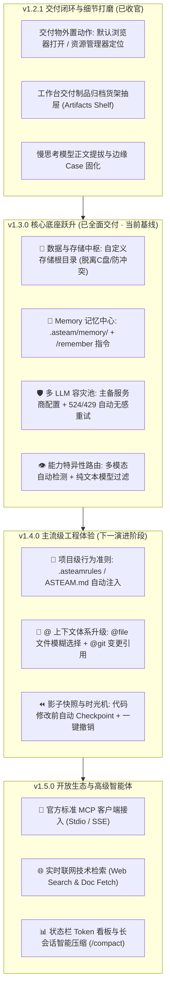

# ASTeam Agent 产品演进全景路线图 (Roadmap)

> **版本定位**：企业级 Windows 桌面智能体客户端 · 基于 `deepseek-harness` 内核深度封装，集成实时交互控制台、原生多模态产物所见即所得预览、全周期置顶看板、自主演进技能体系与全能宿主操作能力。
> **规划周期**：2026 Q1 - Q3 · 从“单机体验完善”到“企业级工程智能体”的完整演进。

---

## 🎯 核心演进理念

1. **工程化与确定性 (Determinism & Safety)**：智能体不仅要“能写代码”，更要“可控、可撤销、可回滚”，杜绝破坏用户生产代码库；
2. **零环境污染与可移植 (Storage & Isolation)**：数据与工作区彻底脱离 C 盘，用户自由指定存储根目录，绝不与 Cursor、Claude Code、Cline 等其他 Agent 争夺路径或锁定文件；
3. **长期记忆与沉淀 (Memory & Knowledge)**：告别“每次开新会话都要重新教一遍”，打造越用越聪明的专属智能工程助理；
4. **高可用容灾网络 (Multi-Provider Resilience)**：建立多服务商容灾池，底层自动消化 Cloudflare 524 超时与 429 限流，让交互永不断线；
5. **开放标准生态 (Open Standards)**：从自建 Markdown 技能平滑升级至 Anthropic 官方推行的标准 MCP (Model Context Protocol) 客户端。

---

## 🗺️ 全景阶段总览

---

## 📍 阶段一：v1.2.1 交付闭环与细节打磨（当前版本）

### 目标与定位
彻底巩固 v1.2.0 已落地的各项交互与多模态特性，打通交付制品从“应用内预览”到“Windows 桌面外置应用”的最后一公里，并提供统一的制品货架抽屉。

### 核心特性交付清单
1. **🌐 交付制品外置动作 (External Delivery Actions)**：
   - **在系统默认浏览器中打开**：HTML 大屏、可视化报表支持调用系统默认浏览器（Chrome / Edge / Firefox）以独立标签页全屏渲染与交互；
   - **在文件资源管理器中定位 (Reveal in Explorer)**：生成的 `.html`、`.svg`、`.docx`、`.pptx` 文件支持一键高亮选中并唤起 Windows 资源管理器目录；
2. **📦 工作台交付制品归档货架抽屉 (Artifacts Shelf)**：
   - 右侧工作台增加【交付制品】独立标签页；
   - 自动汇总当前会话生成的所有大屏、图表、流程图与 Office 文档；
   - 支持按类型过滤、点击卡片直接载入预览、一键导出或外置打开；
3. **🛡️ 慢思考模型提拔与边缘 Case 固化**：
   - 针对部分 OpenAI 兼容中转网关将所有输出塞入 `reasoning_content` 的情况，确保消息正文、产物预览卡片 100% 正常提拔呈现；
   - 完善空消息气泡的过滤与兜底文案。

---

## 📍 阶段二：v1.3.0 核心底座跃升（存储隔离 + 记忆 + 多LLM容灾）

### 目标与定位
重构客户端基础设施底座，解决企业开发中最痛的“C盘空间报警”、“多 Agent 路径冲突”、“会话记忆丢失”与“上游网关 524 频繁假死”四大顽疾。

### 核心特性交付清单
1. **📁 数据与存储中枢 (Storage & Data Hub)**：
   - **脱离 C 盘，自由指定存储根目录**：在设置中心支持将 ASTeam 存储根目录配置在任意大容量磁盘（如 `D:\ASTeamData\` 或 `E:\AIWorkspace\`）；
   - **子目录模块化隔离**：
     - `workspaces/`：免项目模式的默认生成根目录；
     - `skills/`：全局自定义与安装的技能；
     - `memory/`：长期记忆库与用户画像；
     - `artifacts/`：历史交付物本地存档；
     - `logs/`：调度诊断与终端日志；
   - **一键平滑迁移向导**：支持将原 `~/.asteam` 的数据一键搬家至新目录；
   - **绝对路径零冲突**：杜绝与 Cursor、Claude Code、Cline 等共用主目录时的锁定与冲突。
2. **🧠 长期记忆与知识沉淀体系 (Memory Bank)**：
   - **项目级持久记忆库 (`.asteam/memory/MEMORY.md`)**：自动感知当前工作区，跨会话常驻激活项目技术栈偏好与架构约定；
   - **显式记忆快捷指令 (`/remember` 或 `/learn`)**：用户输入 `/remember 本工程前端必须用 Tailwind 规范`，Agent 自动落盘并终生铭记；
   - **全局用户画像 (`user_profile.md`)**：沉淀用户的编程语言偏好、沟通详略风格；
   - **任务结项自主反思 (Auto-Reflection)**：长链路复杂任务完成后，Agent 能够自主提取避坑要点并沉淀至记忆库。
3. **🛡️ 多 LLM 供应商接入池与 524 自动容灾 (Multi-Provider Fallback)**：
   - **主备供应商配置面板**：支持同时配置多个服务商（如 LLMAPI 网关、硅基流动、DeepSeek 官方、本地 Ollama）；
   - **无感故障转移重试 (Failover Auto-Retry)**：
     - 当主线路遇到 **Cloudflare 524 超时**、**429 限流** 或 **502/503 节点不可用** 时；
     - 底层自动唤醒备用供应商无缝发起重试，杜绝由于单点故障导致 Agent 假死；
   - **轻重模型动态路由 (Model Router)**：规划拆解用低延迟快模型，编码生成用重模型。
4. **👁️ 模型能力特异性识别与多模态路由 (Model Capability & Vision Routing)**：
   - 强类型推导算法自动识别慢思考 R1、Vision 多模态与生图专属模型；
   - 带有图片输入时，容灾队列智能过滤纯文本线路，消除上游 400 Bad Request 隐患；
   - 前端动态呈现能力徽章与附件防御警示。
5. **🧪 真实场景人工验收通过 (Verified)**：
   - 数据中枢路径自定义及 5 大模块子目录自动初始化验证通过；
   - `/remember` 显式记忆落盘与跨会话架构规约自动遵循验证通过（真实组件 `UserStatusBadge.tsx` 严格遵循无 `any` 及 `#006857` 主题色）；
   - Windows 全量安装包与单文件绿色便携版 `ASTeam Agent-Portable-1.3.0.exe` 交付就绪。

---

## 📍 阶段三：v1.4.0 主流级工程体验（下一阶段重点规划 · NEXT）

### 目标与定位
全面对标 Cursor、Windsurf 与 Claude Code 等主流顶尖智能体，引入项目工程规约、全能上下文索引与版本安全回滚能力。

### 核心特性交付清单
1. **📜 项目级行为准则 (`.asteamrules` / `ASTEAM.md`)**：
   - 只要项目根目录下存在 `.asteamrules`，Agent 启动任何新会话时均自动注入规约，确保团队规范严苛落地；
2. **🎯 全能 `@` 上下文补全体系**：
   - 将现有 `@skill` 升级为全能统一引用系统：
     - `@skill`：快捷选择已安装的办公与研发技能；
     - `@file`：模糊检索工作区中的任意源文件，自动注入文件内容；
     - `@git-diff`：引用当前工作区尚未提交的 Git 代码变更；
3. **⏪ 影子快照与时光机一键回滚 (Checkpoint & 1-Click Rollback)**：
   - Agent 在写入或修改项目文件前，后台自动生成轻量 Git 影子快照；
   - 消息气泡提供【⏪ 撤销本轮修改】按钮，1 秒还原工作区，彻底消除用户对“代码改坏”的担忧。

---

## 📍 阶段四：v1.5.0 开放生态与高级智能体

### 目标与定位
连接全球开放生态，接入标准 MCP 协议，支持实时联网检索与长对话上下文智能压缩。

### 核心特性交付清单
1. **🔌 官方标准 MCP (Model Context Protocol) 客户端集成**：
   - 完整支持 Anthropic 标准 Stdio / SSE MCP 协议，无缝接入 GitHub、PostgreSQL、Elasticsearch 等数以万计的社区现成 MCP 工具；
2. **🌐 实时联网技术检索 (Web Search & Doc Fetcher)**：
   - 内置免配置的技术文档与错误码检索，自动抓取官方最新文档，消除大模型知识时效性盲区；
3. **📊 状态栏 Token 消耗透明化看板与智能压缩 (`/compact`)**：
   - 底部状态栏实时显示 Token 消耗、上下文窗口占用率（如 `38k / 128k`）；
   - 提供长对话自动语义浓缩与 `/compact` 机制，防止上下文爆满。

---

## 📝 阶段交付记录

| 版本号 | 发布周期 | 关键交付物 | 状态 |
| :--- | :--- | :--- | :--- |
| **v1.2.0** | 2026-03 | 实时交互终端、多模态分栏拉伸与子窗口、剪贴板直写、@技能、流式传输 | ✅ 已发布并验证 |
| **v1.2.1** | 2026-03 | 浏览器外置打开、资源管理器定位、交付制品货架、慢思考提拔固化 | ✅ 已发布并验证 |
| **v1.3.0** | 2026-04 | 存储中枢自定义(脱离C盘/防冲突)、Memory 记忆中心、多 LLM 接入池 524 自动容灾 | ✅ 已完成重塑与全量验证 |
| **v1.4.0** | 2026-05 | `.asteamrules` 项目规约、全能 `@` 上下文补全、时光机一键回滚 | 📅 规划中 |
| **v1.5.0** | 2026-06 | 标准 MCP 客户端、实时联网搜索、上下文压缩 | 📅 规划中 |
